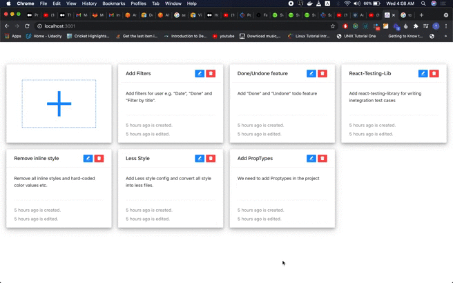
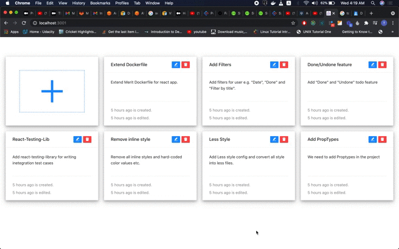
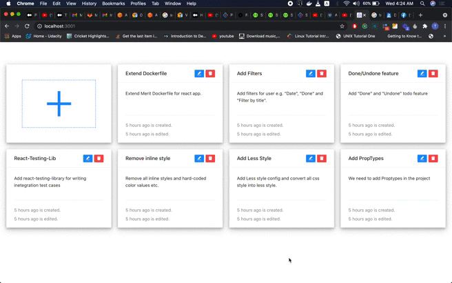
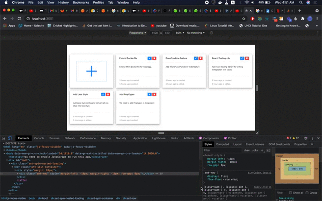

## Pre-conditions

1- Api server should be running at `http://0.0.0.0:3000/` 
2- You should have node >= 14  
3- `yarn` package manager  

## Tools:

1- React 
2- Ant Design 
3- Redux 
4- Redux Saga 

### Step-1: `yarn install`

`cd` to project root directory and run `yarn install` to install the dependencies.

### Step-2 `yarn start`

Runs the app in the development mode. 
You'll see the url in the terminal after running this command.

### Create Todo Gif screenshot:

### Update Todo Gif screenshot:

### Delete Todo Gif screenshot:

### Responsiveness Gif screenshot:

